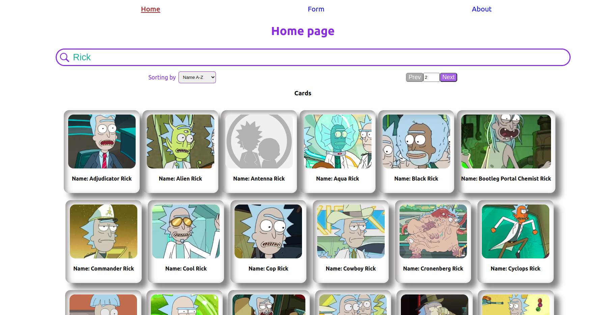
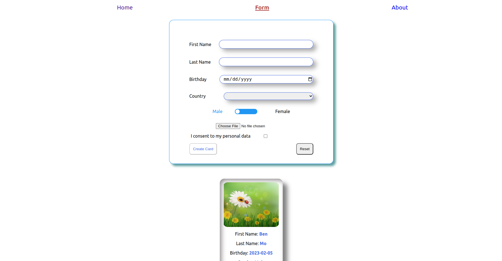
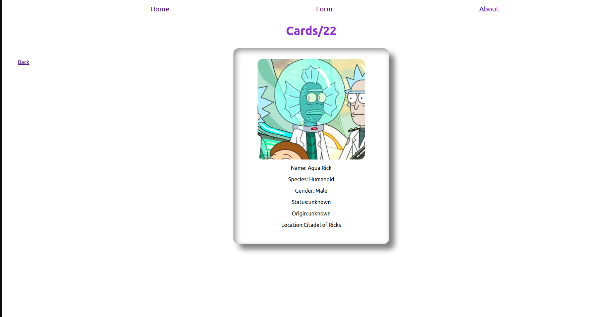

# Project name: Rick and Morty

_**Rick and Morty** is created based on the API Rick and Morty. With this APP you can find all cards related to Rick and Morty or create own cards with appropriate form._

[Demo](https://oxanadanilova.github.io/rick_and_morty/react-redux)

---

---

## Description

This is the [Rolling Scopes School](https://rs.school/index.html) studing project.
It was designed by Alisa Samborskaya ([design in Figma](https://www.figma.com/file/jfEFwkXVj1WRq7sUHDr8os/PetStory-online?node-id=0%3A1)) and developed by [Oxana Danilova](https://github.com/OxanaDanilova)

---

## Technologies

HTML5,CSS, JavaScript, React, TypeScript, Flexbox Layout, React Router v6, Redux, React Testing Library

---

## Contact

[Oxana Danilova](https://www.linkedin.com/in/oxana-danilova-b082a0156/)

---

Made with ❤️
